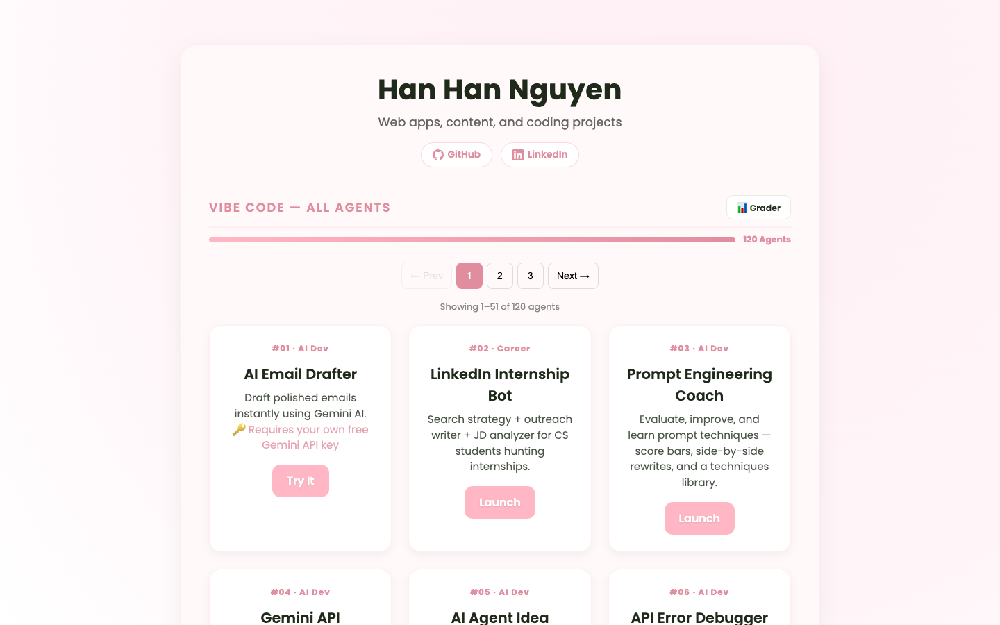

# hi, i'm han han! ✨

[](https://github.com/hhanng/hhanng.github.io/actions/workflows/ci.yml)

> cs student · ai builder · making things that are actually useful (and cute) 🌸

I'm on a mission to build **100 AI-powered mini web-apps** — one at a time, no frameworks, just HTML + CSS + Vanilla JS + Gemini API and a lot of caffeine ☕. I also build study tools for my little sister, English apps for my mom, and websites for local businesses.

📍 Dallas, TX &nbsp;|&nbsp; 🎓 CS Student &nbsp;|&nbsp; 💌 [ngvuhhan07@gmail.com](mailto:ngvuhhan07@gmail.com)
🌐 [hhanng.github.io](https://hhanng.github.io) &nbsp;|&nbsp; 💼 [LinkedIn](https://www.linkedin.com/in/hanhanhazel) &nbsp;|&nbsp; 🐙 [GitHub](https://github.com/hhanng)

---

## 📸 Live Demo



**🔴 Live:** [hhanng.github.io](https://hhanng.github.io) — browse all 120 agents by category, filter, and launch any one with a click.

---

## 🤖 100 ai agents challenge

> *building one AI agent a day until i hit 100. wish me luck lol*

```
██████████████████████████████████████████████████  108 / 100 🏆
```

**100 / 100 complete — Challenge done!** 🎉 — progress bar on the live site updates automatically 🎉

&nbsp;

### 🛠️ ai dev tools
tools for devs, built by a dev (me!)

| # | Agent | What it does |
|---|-------|-------------|
| [#01](https://hhanng.github.io/ai_email_drafter.jsx/) | AI Email Drafter | draft polished emails in seconds with Gemini ✉️ |
| [#03](./100-ai-agents/dev-ai-tools/agent-03-prompt-coach/) | Prompt Engineering Coach | score + rewrite your prompts, side-by-side |
| [#04](./100-ai-agents/dev-ai-tools/agent-04-gemini-playground/) | Gemini API Playground | live prompt testing with temp + token controls |
| [#05](./100-ai-agents/dev-ai-tools/agent-05-agent-idea-generator/) | AI Agent Idea Generator | brainstorm AI project ideas by category & difficulty |
| [#06](./100-ai-agents/dev-ai-tools/agent-06-api-error-debugger/) | API Error Debugger | paste any error → get a plain-English fix with code |
| [#07](./100-ai-agents/dev-ai-tools/agent-07-code-review-bot/) | Code Review Bot | senior-dev feedback: score, issues, fixed version |
| [#08](./100-ai-agents/dev-ai-tools/agent-08-bug-explainer/) | Dev Workflow Companion | Bug Explainer + PR Description + Changelog + 🪜 Step Tracer (step-by-step code execution with variable state) |
| [#09](./100-ai-agents/dev-ai-tools/agent-09-git-commit-writer/) | Dev Workflow Companion Lite | Commit Writer (3 styles) + PR Description + Sprint Summary + 🌿 Branch Namer with git-flow conventions |
| [#10](./100-ai-agents/dev-ai-tools/agent-10-readme-generator/) | README Generator | professional GitHub README with badges + live preview |
| [#11](./100-ai-agents/dev-ai-tools/agent-11-code-comment-generator/) | Code Documentation Suite | Docstring Generator (Google/NumPy/JSDoc) + README + Whiteboard Mode + 🔍 PR Explainer (reviewer-friendly change descriptions) |
| [#28](./100-ai-agents/dev-ai-tools/agent-28-chatbot-builder-guide/) | AI Chatbot Builder Guide | 8-step interactive tutorial to build your own chatbot |
| [#29](./100-ai-agents/dev-ai-tools/agent-29-json-formatter/) | JSON Formatter & Explainer | format, validate, tree-explore, and explain any JSON |
| [#30](./100-ai-agents/dev-ai-tools/agent-30-css-style-generator/) | CSS Style Generator | pick a component + vibe → beautiful CSS with live preview |

&nbsp;

### 📚 study & cs tools
made these to survive my own classes, now sharing them 😅

| # | Agent | What it does |
|---|-------|-------------|
| [#12](./100-ai-agents/study-cs-tools/agent-12-algorithm-explainer/) | Algorithm Explainer | analogies, visual traces, Big O, and a quiz |
| [#13](./100-ai-agents/study-cs-tools/agent-13-cs-concept-simplifier/) | CS Concept Deep Diver | any CS concept → plain English with analogies, code, prerequisite map, FAANG interview angle, and side-by-side Comparison Mode |
| [#14](./100-ai-agents/study-cs-tools/agent-14-quiz-generator/) | Quiz Generator from Notes | paste notes → MCQ / true-false / short-answer quiz |
| [#15](./100-ai-agents/study-cs-tools/agent-15-study-plan-maker/) | Study Plan Maker + FAANG Prep Mode | exam date → study calendar; FAANG mode: 12-week schedule with company-specific notes (Google/Meta/Amazon/Apple/Netflix), LeetCode targets, system design topics, and skill-level hour plans |
| [#16](./100-ai-agents/study-cs-tools/agent-16-homework-solver/) | Homework Problem Solver | step-by-step help that teaches *how* to think |
| [#17](./100-ai-agents/study-cs-tools/agent-17-research-topic-finder/) | Research Topic Finder | 6 unique research topics with thesis + outline |
| [#18](./100-ai-agents/study-cs-tools/agent-18-active-recall-coach/) | Active Recall Coach | paste notes → flashcard drill → weak spot re-drill |
| [#19](./100-ai-agents/study-cs-tools/agent-19-exam-anxiety-coach/) | Exam Anxiety Coach | box breathing, thought reframing, pep talk, checklist 💆‍♀️ |
| [#20](./100-ai-agents/career-interview-prep/agent-20-tech-interview-prep/) | Tech Interview Prep Bot | real tech interview sim with AI feedback + final grade |
| [#41](./100-ai-agents/study-cs-tools/agent-41-dp-coach/) | Dynamic Programming Coach | animated DP table visualizer for 10 classic problems |
| [#42](./100-ai-agents/study-cs-tools/agent-42-recursion-visualizer/) | Recursion Visualizer | live call stack explorer — Fibonacci, Merge Sort, Hanoi |
| [#45](./100-ai-agents/study-cs-tools/agent-45-os-concepts-simulator/) | OS Concepts Simulator | CPU scheduling, memory, page replacement, deadlocks |
| [#51](./100-ai-agents/study-cs-tools/agent-51-leetcode-pattern-trainer/) | LeetCode Pattern Trainer | 12 core patterns with templates, problems + progress tracking |
| [#52](./100-ai-agents/study-cs-tools/agent-52-binary-search-masterclass/) | Binary Search Masterclass | 6 binary search patterns, code templates, tiered practice |
| [#53](./100-ai-agents/bilingual-english-family/agent-53-us-high-school-survival-guide/) | US High School Survival Guide | GPA, SAT/ACT, college prep, grade checklists for 9th–12th |

&nbsp;

### 💼 career tools
because getting an internship is basically a full-time job

| # | Agent | What it does |
|---|-------|-------------|
| [#02](./100-ai-agents/career-interview-prep/agent-02-linkedin-bot/) | LinkedIn Internship Bot | search strategy + outreach writer + JD analyzer |
| [#21](./100-ai-agents/career-interview-prep/agent-21-cover-letter-generator/) | Cover Letter Generator | personalized cover letters with JD keyword matching |
| [#22](./100-ai-agents/career-interview-prep/agent-22-mock-interview-coach/) | Mock Interview Coach | chat-style HR interviews + scored session report |
| [#23](./100-ai-agents/career-interview-prep/agent-23-resume-bullet-rewriter/) | Resume Bullet Rewriter | weak bullets → 3 strong, metric-driven ATS versions |
| [#24](./100-ai-agents/career-interview-prep/agent-24-cold-email-recruiter/) | Recruiter Outreach Suite | cold email writer + Day 7/14/21 follow-up sequence generator + referral request script (LinkedIn DM, email, + 3 things NOT to say) |
| [#25](./100-ai-agents/career-interview-prep/agent-25-jd-analyzer/) | Internship JD Analyzer | match score, keyword chips, gaps, + "should I apply?" verdict |
| [#48](./100-ai-agents/career-interview-prep/agent-48-faang-application-tracker/) | FAANG Application Tracker | track apps through 9 stages, CSV export, stats dashboard |
| [#49](./100-ai-agents/career-interview-prep/agent-49-faang-comp-negotiator/) | FAANG Comp Negotiator | offer analyzer, negotiation scripts, TC calculator |
| [#50](./100-ai-agents/career-interview-prep/agent-50-linkedin-connection-generator/) | LinkedIn Outreach Suite | message generator (4 types, 3 AI variants) + message tracker with reply-rate stats + warm intro chain mapper with visual hop visualization |
| [#67](./100-ai-agents/career-interview-prep/agent-67-interview-confidence-coach/) | Interview Confidence Coach | 4-7-8 breathing, affirmations, 40 practice questions with hints + self-rating, body language tips, progress dashboard |
| [#68](./100-ai-agents/study-cs-tools/agent-68-coding-quiz-battle/) | Coding Quiz Battle | 100 questions across 10 CS topics, 20s timer, streak bonuses, answer explanations, personal leaderboard, topic accuracy stats |

&nbsp;

### 🗣️ english learning tools
built for my mom and my little sister 🥹

| # | Agent | What it does |
|---|-------|-------------|
| [#26](./100-ai-agents/bilingual-english-family/agent-26-daily-life-english/) | Daily Life English Learner | bilingual EN/VI for grocery, doctor, bank and more |
| [#27](./100-ai-agents/bilingual-english-family/agent-27-basic-conversation-practice/) | Basic Conversation Practice | bilingual AI chat partner for Vietnamese beginners |
| [#38](./100-ai-agents/bilingual-english-family/agent-38-slang-decoder/) | American Slang Decoder | bilingual slang guide for Vietnamese teens + cringe-o-meter |
| [#39](./100-ai-agents/bilingual-english-family/agent-39-idiom-of-the-day/) | Idiom of the Day | daily idioms with VI translations, origin stories, mini games |
| [#40](./100-ai-agents/bilingual-english-family/agent-40-basketball-english-vocab/) | Basketball English Vocab | bilingual vocab flashcards + quiz for teen players |
| [#44](./100-ai-agents/bilingual-english-family/agent-44-school-conversation-coach/) | School Conversation Coach | scripts for making friends, talking to teachers, and more |
| [#43](./100-ai-agents/bilingual-english-family/agent-43-american-pop-culture-explainer/) | Pop Culture Explainer | TikTok trends, memes, shows explained simply for ESL learners |
| [#46](./100-ai-agents/bilingual-english-family/agent-46-esl-grammar-checker/) | ESL Grammar Checker | gentle grammar fixes with level-matched tips |
| [#47](./100-ai-agents/bilingual-english-family/agent-47-book-report-buddy/) | Book Report Buddy | summaries, themes, quotes, and outlines for school books |
| [#54](./100-ai-agents/bilingual-english-family/agent-54-english-essay-writing-coach/) | English Essay Writing Coach | essay types, outline builder, structured lessons + practice prompts |

&nbsp;

### 🎮 games & creative tools
for when you need a break from studying lol

| # | Agent | What it does |
|---|-------|-------------|
| [#31](./100-ai-agents/games-creative/agent-31-two-truths-lie/) | Two Truths & a Lie | AI-generated party game sets on any topic |
| [#32](./100-ai-agents/games-creative/agent-32-meme-caption-generator/) | Meme Caption Generator | AI captions for 20 meme templates + PNG download |
| [#33](./100-ai-agents/games-creative/agent-33-daily-dare-generator/) | Daily Dare Generator | personalized daily challenges with streak + badges |
| [#34](./100-ai-agents/games-creative/agent-34-pixel-art-idea-generator/) | Pixel Art Idea Generator | AI pixel art ideas with Canvas previews + editor |
| [#35](./100-ai-agents/games-creative/agent-35-mandala-designer/) | Mandala Pattern Designer | describe a mood → AI draws a custom mandala 🌀 |
| [#36](./100-ai-agents/games-creative/agent-36-recipe-remix-bot/) | Recipe Remix Bot | remix any recipe — healthier, fusion, or budget-friendly |
| [#37](./100-ai-agents/games-creative/agent-37-this-day-in-history/) | This Day in History Bot | fascinating stories for any date + Vietnam connection mode |
| [#65](./100-ai-agents/games-creative/agent-65-star-wars-builder/) | Fan Wiki Builder | AI story builder, fan wiki generator (exportable HTML), lore guide, trivia quiz, character collection — plus 🎓 Web Dev tab teaching HTML/CSS/JS with GitHub Pages deployment guide |

### 🗂️ productivity tools
for getting things out of your head and onto the page

| # | Agent | What it does |
|---|-------|-------------|
| [#62](./100-ai-agents/productivity/agent-62-brain-dump-quick-notes/) | Brain Dump + English Journal Mode | fast brain-dump with auto-save, #tag grid, pin & archive — plus Journal Mode with word-count goals, live progress bar, vocab detector, streak counter, and weekly summary |

&nbsp;

### 📱 product & startup tools
for founders, indie hackers, and anyone shipping something

| # | Agent | What it does |
|---|-------|-------------|
| [#69](./100-ai-agents/study-cs-tools/agent-69-algorithm-visualizer/) | Algorithm Visualizer | 12 sorting/searching/graph algorithms animated step-by-step, adjustable speed, and built-in challenges |
| [#70](./100-ai-agents/career-interview-prep/agent-70-tech-career-roadmap-planner/) | Tech Career Roadmap Planner | 8 career tracks with step-by-step skill checklists from beginner to senior |
| [#71](./100-ai-agents/business-startup-tools/agent-71-landing-page-copywriter/) | Landing Page Copywriter | 3 headline variants, hero copy, features, testimonials, CTAs, and FAQs |
| [#72](./100-ai-agents/business-startup-tools/agent-72-mvp-scope-definer/) | MVP Scope Definer | scope verdict + MoSCoW prioritizer + one-page MVP canvas |
| [#73](./100-ai-agents/business-startup-tools/agent-73-pitch-deck-studio/) | Pitch Deck Studio | 10-slide investor deck wizard with pro tips and markdown export |
| [#74](./100-ai-agents/business-startup-tools/agent-74-app-store-optimization-suite/) | App Store Optimization Suite | ASO score analyzer, keyword string builder, iOS & Play preview, launch checklist |
| [#75](./100-ai-agents/business-startup-tools/agent-75-agile-pm-toolkit/) | Agile PM Toolkit | drag-and-drop Kanban, sprint planner with burndown, retro board, velocity chart + forecast |
| [#76](./100-ai-agents/business-startup-tools/agent-76-ab-test-designer/) | A/B Test Designer | hypothesis builder, sample size calculator, significance checker with p-value, result logger |
| [#77](./100-ai-agents/business-startup-tools/agent-77-seo-content-optimizer/) | SEO Content Optimizer | content analyzer with SEO score, meta builder, intent classifier, heading validator, 30-item checklist |
| [#78](./100-ai-agents/business-startup-tools/agent-78-brand-identity-builder/) | Brand Identity Builder | 12-archetype picker with tone auto-fill, voice sliders, color palette + WCAG contrast, 10 font pairings, markdown export |
| [#79](./100-ai-agents/business-startup-tools/agent-79-product-launch-war-room/) | Product Launch War Room | 30-item checklist with critical blockers, countdown timer, drag-and-drop timeline, 10-channel tracker, debrief logger |
| [#80](./100-ai-agents/business-startup-tools/agent-80-business-model-canvas/) | Business Model Canvas | interactive 9-block BMC with multi-canvas, 3 pre-filled examples, guide, and markdown export |
| [#81](./100-ai-agents/business-startup-tools/agent-81-competitive-analysis-tool/) | Competitive Analysis Tool | weighted scoring matrix, SWOT builder, positioning map, auto-generated report |
| [#82](./100-ai-agents/business-startup-tools/agent-82-email-marketing-suite/) | Email Marketing Suite | email composer with live preview, subject scorer, drip sequences, campaign analyzer, 6 templates |
| [#83](./100-ai-agents/health-fitness/agent-83-cs-student-fitness-os/) | CS Student Fitness OS | 3 workout plans, 8 desk breaks, rest timer, session tracker, streak + weekly stats |
| [#84](./100-ai-agents/health-fitness/agent-84-coders-hiit-timer/) | Coder's HIIT Timer | Pomodoro-HIIT hybrid timer, Tabata & Pure HIIT modes, 10 desk-friendly routines, SVG ring countdown, session history with streak tracking |
| [#85](./100-ai-agents/health-fitness/agent-85-pr-strength-tracker/) | PR & Strength Tracker | workout log with auto-PR detection, e1RM estimates, plateau detector, progress charts, 4-week Big 3 progression planner |
| [#86](./100-ai-agents/health-fitness/agent-86-period-cycle-tracker/) | Period & Cycle Tracker (Bilingual) | cycle calendar, 22-symptom log with EN/VI labels, 50 health terms EN/VI, doctor scripts with side-by-side EN/Vietnamese, and "Giải thích với Ba Mẹ" with 5 culturally respectful parent conversation scenarios |
| [#87](./100-ai-agents/health-fitness/agent-87-skincare-routine-tracker/) | Skincare Routine Tracker | AM/PM routine builder, ingredient decoder with EWG Skin Deep® scores (1–10), safety checker, 30-day skin journal, and 💚 Budget tab with 3 drugstore routines (~$30–$50) and best-value ingredient breakdowns |
| [#88](./100-ai-agents/health-fitness/agent-88-glowup-tracker-vision-board/) | Glow-Up Tracker & Vision Board | vision board across 6 life categories, 30 "First Year in America" milestone cards, bilingual EN/VI journal, weekly radar glow chart |
| [#89](./100-ai-agents/health-fitness/agent-89-meal-macro-tracker/) | Vietnamese-American Meal & Macro Tracker | 40 Vietnamese + 40 American foods with real macros, traditional recipes with US pantry substitutions, bilingual EN/VI nutrition vocab, daily calorie tracking |
| [#90](./100-ai-agents/health-fitness/agent-90-body-composition-tracker/) | Body Composition Tracker | weekly check-in log with Cut/Bulk/Maintain/Recomp modes, lean/fat mass dashboard, trend chart with moving average, TDEE calc, US Navy body fat estimator |
| [#91](./100-ai-agents/health-fitness/agent-91-workout-split-planner/) | Coder's Workout Split Planner | 6 splits (2-day to 6-day PPL), weekly calendar, 50 exercises with filters, recovery routines for wrist/neck/hips/eyes, 20-20-20 eye strain timer |
| [#92](./100-ai-agents/dev-ai-tools/agent-92-react-component-playground/) | React Component Playground | live JSX editor (Ctrl+Enter), 10 pre-built components, 5 React patterns, hooks reference, 15 interview Q&As, React 18 + Babel in srcdoc iframe |
| [#93](./100-ai-agents/study-cs-tools/agent-93-machine-learning-visualizer/) | Machine Learning Visualizer | 6 Canvas visualizations (Linear Regression, Logistic, KNN, K-Means, Neural Net, Decision Tree), 8 algo cards, confusion matrix calc, 20 flip-card Q&As |
| [#94](./100-ai-agents/study-cs-tools/agent-94-cybersecurity-basics-trainer/) | Cybersecurity Basics Trainer | 10 challenges (Caesar cipher, hash ID, SQL injection, password entropy, Base64), OWASP Top 10, 20 security tools comparison, 20 interview Q&As |
| [#95](./100-ai-agents/study-cs-tools/agent-95-cloud-architecture-designer/) | Cloud Architecture Designer | drag-and-drop canvas with SVG connections, 30 multi-cloud components, 10 system design patterns, cost estimator comparing AWS/GCP/Azure |
| [#96](./100-ai-agents/business-startup-tools/agent-96-personal-finance-cs-students/) | Personal Finance for CS Students | TC calculator with vesting & COL adjuster, 50/30/20 budget, compound interest chart, 401k/RSU/HSA guides, 5-stage roadmap with net worth tracker |
| [#97](./100-ai-agents/business-startup-tools/agent-97-build-in-public-playbook/) | Build in Public Playbook | platform matcher, 50 content templates, weekly planner with streak tracker, GitHub README generator, Twitter bio scorer, LinkedIn headline builder |
| [#98](./100-ai-agents/study-cs-tools/agent-98-graph-algorithms-visualizer/) | Graph Algorithms Visualizer | 9 algorithms animated step by step (BFS, DFS, Dijkstra, Bellman-Ford, Prim's, Kruskal's, Topo Sort, Cycle Detection, Bipartite), 6 example graphs, 15 challenges, 20 flip-card Q&As |
| [#99](./100-ai-agents/study-cs-tools/agent-99-llm-generative-ai-roadmap/) | LLM & Generative AI Roadmap | 6-stage roadmap from foundations to production, 20 concept explainers (self-attention, RAG, RLHF, temperature, LoRA, quantization), prompt builder, token counter, 40 curated resources |
| [#100 🏆](./100-ai-agents/career-interview-prep/agent-100-behavioral-interview-star-bank/) | Behavioral Interview STAR Bank | STAR story bank with quality checker, 60 questions across all 16 Amazon LPs + Google/Meta/Apple/Microsoft, answer analyzer (5 dimensions), LP mapper, "tell me about yourself" builder |
| [#101](./100-ai-agents/career-interview-prep/agent-101-faang-mock-coding-round/) | FAANG Mock Coding Round | 20 problems (5 Easy / 10 Medium / 5 Hard), 45-min SVG ring timer, Python/JS/Java editor with line numbers, 3 progressive hints per problem, model solutions with complexity, self-rating system, history + streak dashboard |
| [#102](./100-ai-agents/bilingual-english-family/agent-102-viet-teen-school-navigator/) | Vietnamese Teen School Navigator | 8-tab school guide in EN/VI for Vietnamese families — Registration, Classroom, Counselor/IEP, Grades + GPA calculator, AP & Honors, Clubs, College Prep 30-month timeline, Talking to Parents; 50-term glossary, flip cards, progress checklists |
| [#103](./100-ai-agents/dev-ai-tools/agent-103-fullstack-scaffold-generator/) | Full-Stack Project Scaffold Generator | 3-step wizard, 6 tech-stack presets (Next.js, Vite, T3, Django, NestJS, SvelteKit), generates file tree, package.json, .env.example, README.md, first 5 git commits, 30-day build plan; dark/light toggle |
| [#104](./100-ai-agents/bilingual-english-family/agent-104-moms-english-survival-kit/) | Mom's Everyday English Survival Kit | 10 life-situation tabs (Grocery, Doctor, Bank, DMV, Workplace, Phone, Landlord, School, Emergency, Small Talk) with EN/VI flip cards, full conversation scripts, text-to-speech audio, fill-in-blank quizzes, personal phrasebook |
| [#105](./100-ai-agents/study-cs-tools/agent-105-cs-interview-question-bank/) | CS Interview Question Bank | 200 CS interview questions across DSA, System Design, and Behavioral with full answers and difficulty ratings |
| [#106](./100-ai-agents/bilingual-english-family/agent-106-ai-english-writing-coach/) | AI English Writing Coach | Essay feedback tool, grammar checker, vocabulary upgrader, and writing style analyzer for ESL learners |
| [#107](./100-ai-agents/business-startup-tools/agent-107-startup-idea-validator/) | Startup Idea Validator | Validate startup ideas with market size estimation, competitor analysis, SWOT breakdown, and investor pitch scoring |
| [#108](./100-ai-agents/study-cs-tools/agent-108-flashcard-srs-system/) | Flashcard System with SRS | Spaced repetition flashcard system with a FAANG DSA deck (80 cards) and ESL vocabulary deck (60 cards) |
| [#109](./100-ai-agents/bilingual-english-family/agent-109-vietnamese-american-family-planner/) | Vietnamese-American Family Planner | Family coordination tool for Vietnamese-American households — bilingual chores, shared budgets, and event calendar |
| [#110](./100-ai-agents/career-interview-prep/agent-110-faang-behavioral-story-bank/) | FAANG Behavioral Story Bank | STAR story builder for 50 behavioral questions with company-specific customization for Google, Meta, Amazon, Apple, Netflix |
| [#111](./100-ai-agents/study-cs-tools/agent-111-data-structures-visualizer/) | Data Structures Visualizer Suite | 8 animated visualizers (Array, Linked List, Stack, Queue, BST, Heap, Hash Table, Trie) with step-mode, speed control, Interview Notes, and Python code panels |
| [#112](./100-ai-agents/study-cs-tools/agent-112-sat-act-prep-suite/) | SAT & ACT Full Prep Suite | 500 vocab words, 4 study modes, 20 reading passages, 100 math problems, 45-min timed practice test, and live progress dashboard |
| [#113](./100-ai-agents/bilingual-english-family/agent-113-bilingual-phrasebook/) | Vietnamese ↔ English Bilingual Phrasebook | 500+ phrases, 10 life categories, EN/VI audio playback, browse/flashcard/quiz/starred modes, fuzzy-match quiz |
| [#114](./100-ai-agents/career-interview-prep/agent-114-pm-interview-simulator/) | FAANG Mock PM Interview Simulator | 120 questions, 6 interview types, company tracks, 5-dimension scoring rubric, model answers, session history |
| [#115](./100-ai-agents/bilingual-english-family/agent-115-us-immigration-guide/) | US Immigration & Life Guide EN/VI | visa types, green card, naturalization with all 100 USCIS civics Q&As, rights, emergency scripts EN/VI |
| [#116](./100-ai-agents/study-cs-tools/agent-116-advanced-patterns-trainer/) | Advanced FAANG Patterns Trainer | 20 coding patterns, 100 problems, animated diagrams, pattern identifier quiz, timed challenges |
| [#117](./100-ai-agents/bilingual-english-family/agent-117-bilingual-math-tutor/) | Bilingual Math Tutor EN/VI | 6 math subjects, 170 problems with step-by-step EN/VI solutions, visual explanations, interactive unit circle |
| [#118](./100-ai-agents/career-interview-prep/agent-118-networking-referral-tracker/) | FAANG Networking & Referral Tracker | contact tracker, outreach sequences, referral pipeline, coffee chat prep, and network map visualization |
| [#119](./100-ai-agents/bilingual-english-family/agent-119-teen-english-survival-kit/) | Vietnamese Teen English Survival Kit | 10 modules, 200+ bilingual EN/VI scenarios, social survival guide for Vietnamese teens in US high school |
| [#120](./100-ai-agents/study-cs-tools/agent-120-system-design-library/) | System Design Deep Dive Library | 30 systems with animated architecture diagrams, component breakdowns, trade-off analysis, interview guides |

&nbsp;

---

## 🎀 special projects — TTTT
*custom tools I built for specific people in my life*

| Project | What it does |
|---------|-------------|
| [Ender's Game Flashcards](./100-ai-agents/sister-study-apps/tt-01-enders-game-flashcards/) | 40 study cards + AI card generator for 9th graders reading Ender's Game |
| [US States & Capitals Explorer](./100-ai-agents/sister-study-apps/tt-02-us-states-capitals/) | zoomable map, flashcards & shape quiz — built for my sister's 8th grade class |

---

## 🌟 other stuff i've built

### ai x platform
| Project | What it does |
|---------|-------------|
| [AI Playlist Roaster](https://spotify-roaster.streamlit.app/) | connects to your Spotify + lets Gemini roast your music taste in Gen-Z slang 💀 |
| [Reminder-Bot](https://hhanng.github.io/reminder-bot) | Telegram bot that sets reminders + syncs with Google Calendar |

### mini web apps
| Project | What it does |
|---------|-------------|
| [Pixel Mood Diary](https://hhanng.github.io/emotion-calendar./) | pixel-art journal to track your daily mood and wishes 🎨 |
| [Egg Timer](https://hhanng.github.io/EGG-TIMER/) | a playful countdown timer built with JS and CSS 🥚 |
| [Study Timer](https://hhanng.github.io/STUDY-TIMER/) | Pomodoro-style focus timer ⏱️ |

### websites
| Project | What it does |
|---------|-------------|
| [HHAN Nail Salon](https://hhanng.github.io/HHAN-nail-salon-website/) | minimalist responsive website for a local nail salon 💅 |
| [HAN HAN NAILBAR](https://hhanng.github.io/hanhan-nail-salon-website-legacy/) | modern nail bar concept with luxurious service showcase |

### marketing
| Project | What it does |
|---------|-------------|
| [ULUX Nail Spa](https://www.instagram.com/uluxnailspa.oaklawn/?hl=en) | social content & campaign visuals for a Dallas nail spa 📸 |

---

## ✨ a note from me

thanks for stopping by! 🌸 i build all of this because i genuinely love making things that help people — whether that's my mom learning English, my sister acing her quizzes, or CS students like me trying to land their first internship.

everything here is open source and free to use. if something helps you, that genuinely makes my day 🥹

*— han han*

&nbsp;

---
<sub>📍 live site: <a href="https://hhanng.github.io">hhanng.github.io</a> · last updated: 2026-09-01 · 120 agents built · latest: #120 System Design Deep Dive Library: ./100-ai-agents/study-cs-tools/agent-120-system-design-library/</sub>
